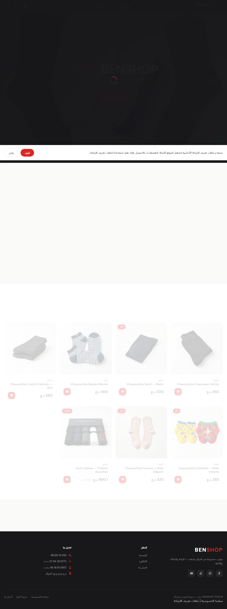
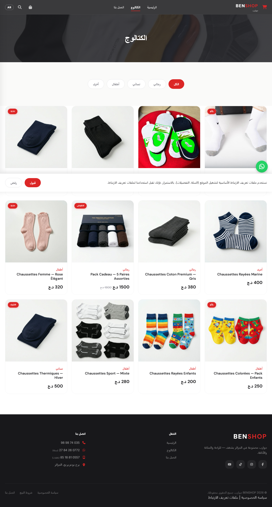
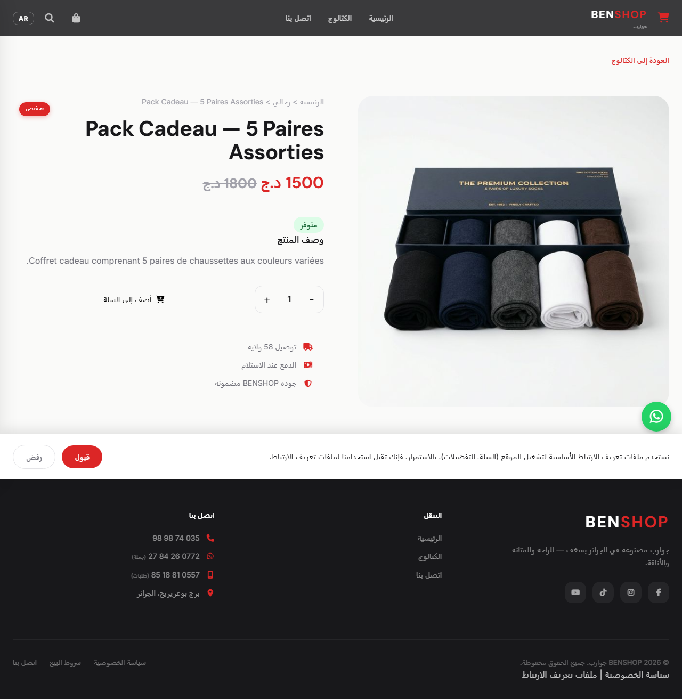
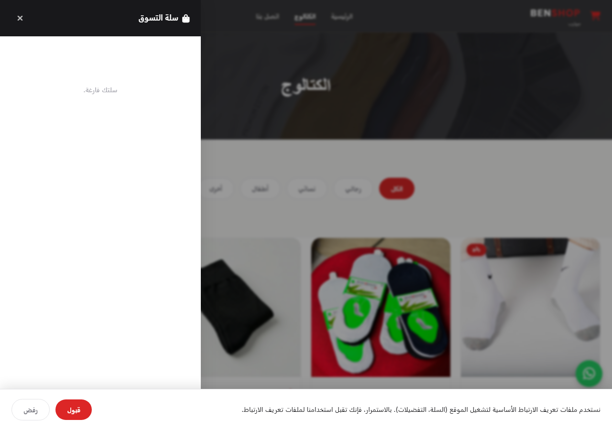
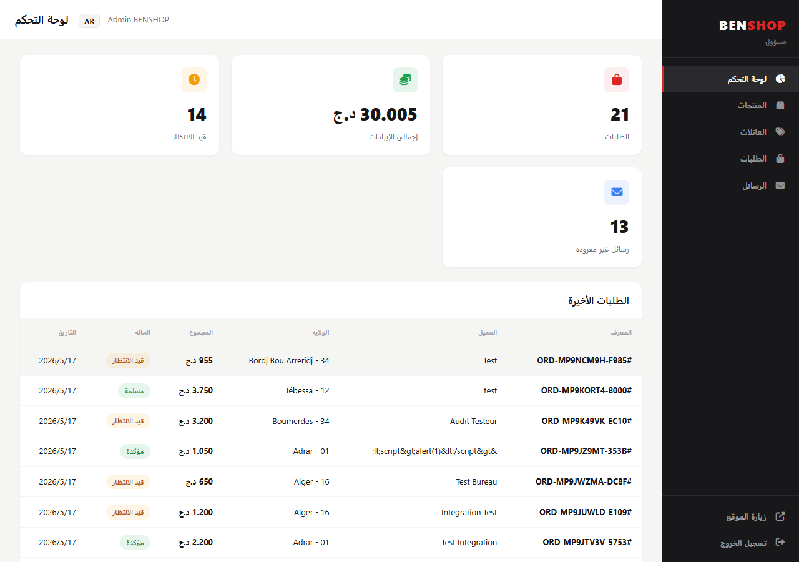
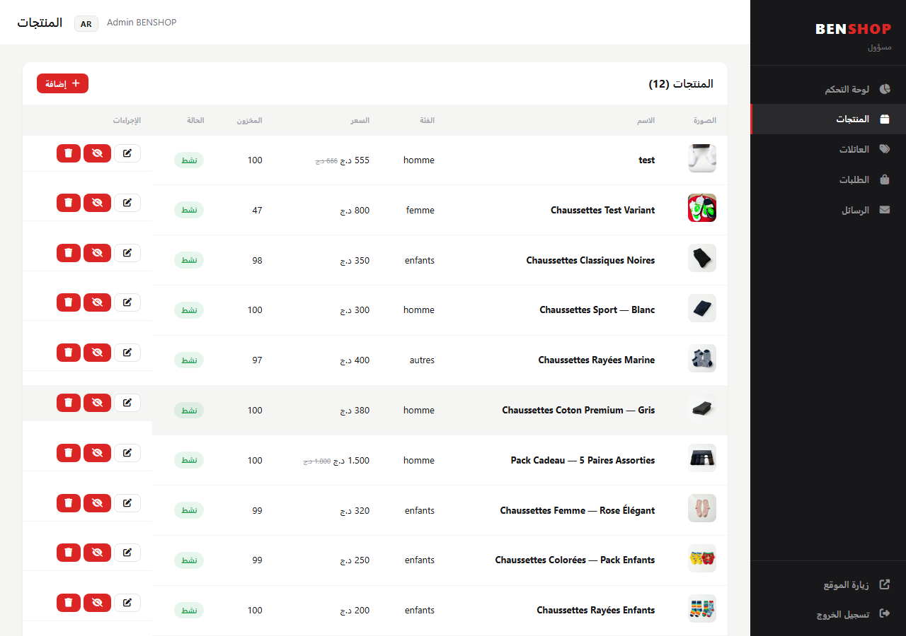
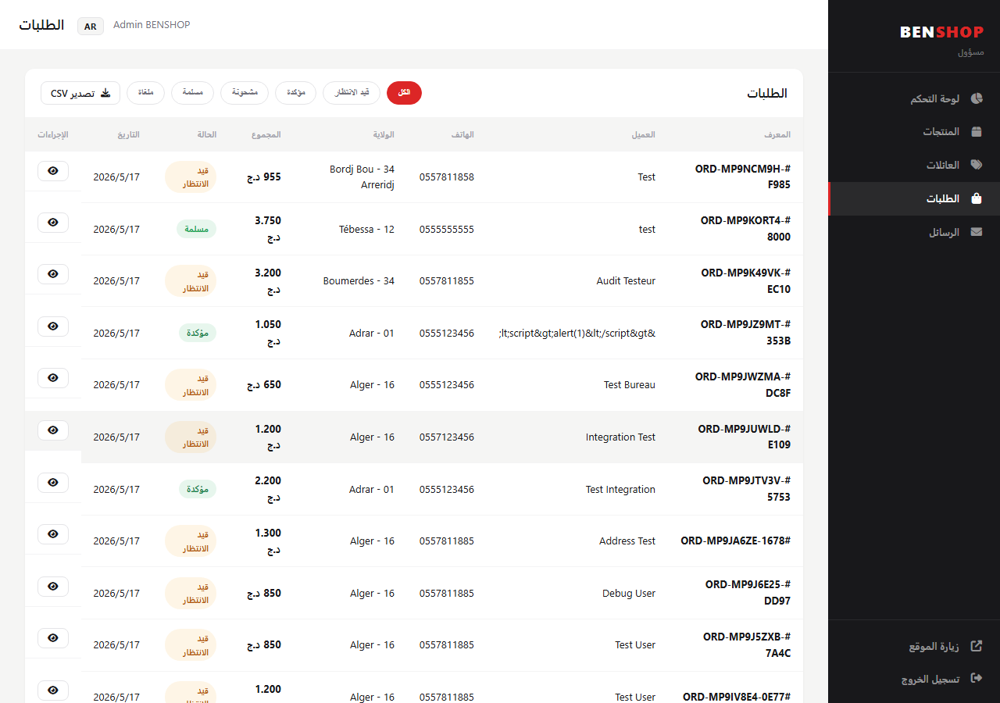
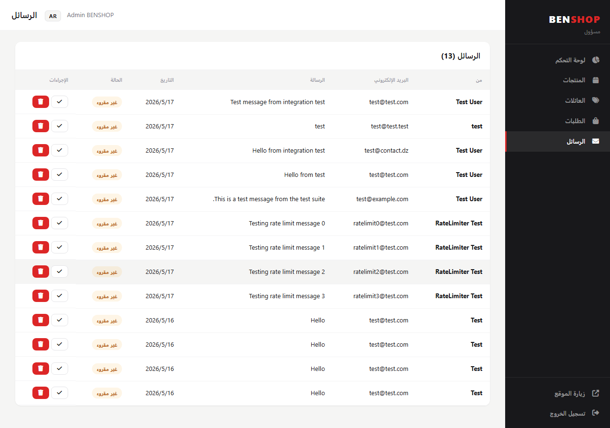

# BENSHOP Chaussettes

> E-commerce website for **SARL BENSHOP Chaussettes** — a premium sock manufacturer based in Bordj Bou Arreridj, Algeria. Serves the Algerian market with cash-on-delivery shipping across all 58 wilayas.

---

## Features

### Customer-Facing (Frontend)
- **Multilingual** — Arabic (RTL), French, English with instant language switching
- **Product catalog** — Filter by category (Men / Women / Kids / Others) and sock family (Classic, Low Cut, Mid Calf, etc.)
- **Product detail page** — Multi-image gallery, stock indicators, quantity picker, JSON-LD structured data for SEO
- **Shopping cart** — Persistent localStorage cart, add/remove items, quantity controls
- **Guest checkout** — Name, phone, wilaya + commune selector, home/office delivery, delivery fee calculated server-side per wilaya
- **WhatsApp ordering** — One-tap order via WhatsApp with pre-filled message
- **Order tracking** — Look up order by ID + last 6 digits of phone number
- **Contact form** — Rate-limited form with server-side validation
- **SEO** — Open Graph, Twitter Cards, JSON-LD (Organization + Product + BreadcrumbList), canonical URLs, sitemap.xml, robots.txt
- **Cookie consent banner** — GDPR-style consent with accept/decline
- **Mobile-first** — Bottom navigation, swipe-to-close cart drawer, haptic feedback
- **Search** — Ctrl+K search modal with live results

### Admin Panel
- **Dashboard** — Total orders, revenue, pending orders, unread messages, recent orders, top products
- **Product management** — CRUD with multi-image upload, family assignment, soft-delete, permanent delete with order-reference check
- **Order management** — Status workflow (pending → confirmed → shipped → delivered / cancelled), stock adjustment on confirmation, WhatsApp customer link
- **CSV export** — Localized order export (FR/EN/AR)
- **Message inbox** — Read/delete contact messages with read/unread status
- **Family management** — CRUD for product families (sock types)
- **Authentication** — JWT + httpOnly cookie, admin role check, rate-limited login

### Backend
- **Express + sql.js** — In-memory SQLite persisted to disk with debounced saves
- **Schema migrations** — 7 migration steps with automatic column additions and data migrations
- **Security** — Helmet (CSP, CORS), rate limiting, input sanitization, path traversal protection on image delete, file type validation on upload
- **Server-side delivery fees** — Calculated from wilaya data, not client-submitted
- **Compression** — gzip/brotli via `compression` middleware
- **Graceful shutdown** — Flushes pending DB writes on SIGINT/SIGTERM

---

## Tech Stack

| Layer | Technology |
|-------|-----------|
| Runtime | Node.js |
| Server | Express 4 |
| Database | sql.js (in-memory SQLite, persisted to file) |
| Auth | JWT + bcryptjs, httpOnly cookies |
| Upload | Multer (disk storage, 5MB limit, MIME validation) |
| Frontend | Vanilla JS, no framework |
| CSS | Custom CSS with CSS variables, RTL support |
| i18n | Custom translation system (AR/FR/EN, 900+ keys) |
| Icons | Font Awesome 6 |
| SEO | JSON-LD, Open Graph, Twitter Cards, sitemap, robots.txt |

---

## Project Structure

```
benshop/
├── .env.example              # Environment variable template
├── .gitignore
├── package.json
├── package-lock.json
├── README.md
│
├── admin/                    # Admin SPA
│   ├── index.html            # Single-page admin app
│   ├── admin.js              # Admin logic (products, orders, messages, families)
│   ├── admin.css             # Admin styles (LTR)
│   ├── admin-rtl.css         # Admin styles (RTL)
│   └── translations.js      # Admin i18n (AR/FR/EN)
│
├── public/                   # Served by Express as static files
│   ├── index.html            # Homepage
│   ├── catalog.html          # Product catalog
│   ├── product.html          # Product detail
│   ├── contact.html          # Contact form
│   ├── privacy.html          # Privacy policy
│   ├── terms.html            # Terms of sale
│   ├── cookies.html          # Cookie consent info
│   ├── 404.html              # Custom 404 page
│   ├── index.css             # Main stylesheet
│   ├── rtl.css               # RTL overrides
│   ├── script.js             # Main frontend logic
│   ├── api.js                # API client with fallback data
│   ├── translations.js      # Frontend i18n (AR/FR/EN)
│   ├── analytics.js          # GA4 stub with consent management
│   ├── robots.txt
│   ├── sitemap.xml
│   ├── assets/images/        # Static product/category images
│   └── uploads/              # User-uploaded images (gitignored)
│       └── products/
│
└── server/                   # Express backend
    ├── index.js              # App entry point, middleware setup
    ├── config.js             # Centralized config from env vars
    ├── db/
    │   └── init.js            # DB init, migrations, seed data, query helpers
    ├── middleware/
    │   └── auth.js            # JWT auth + admin middleware
    ├── routes/
    │   ├── api.js             # Public product/family API
    │   ├── auth.js            # Login/logout/session
    │   ├── orders.js          # Order creation + tracking
    │   ├── admin.js           # Admin CRUD, dashboard, CSV export, uploads
    │   └── contact.js         # Contact form
    └── utils/
        ├── errors.js          # Centralized i18n error messages
        ├── validators.js      # Input validation + sanitization
        └── wilayas.js          # Algeria 58 wilayas with communes & delivery fees
```

---

## Getting Started

### Prerequisites
- Node.js 18+
- npm

### Installation

```bash
# Clone the repo
git clone https://github.com/labssynova-coder/benshop.git
cd benshop

# Install dependencies
npm install

# Create your .env file
cp .env.example .env
# Edit .env with your values (see below)

# Initialize the database (creates tables, runs migrations, seeds data)
npm run seed

# Start the server
npm start
```

The app runs at **http://localhost:3000** by default.

### Environment Variables

| Variable | Required | Default | Description |
|----------|----------|---------|-------------|
| `PORT` | No | `3000` | Server port |
| `NODE_ENV` | No | `development` | `production` enforces JWT secret |
| `JWT_SECRET` | **Yes** | — | Random 64+ char string for JWT signing |
| `JWT_EXPIRES_IN` | No | `7d` | JWT expiration |
| `ADMIN_EMAIL` | No | `admin@benshop.dz` | Admin user email |
| `ADMIN_PASSWORD` | **Yes** | — | Admin user password (set before first `npm run seed`) |
| `WHATSAPP_ORDERS` | No | `213696409537` | WhatsApp number for orders |
| `WHATSAPP_WHOLESALE` | No | `213772268427` | WhatsApp number for wholesale |
| `DB_PATH` | No | `./server/db/benshop.sqlite` | SQLite database file path |
| `CORS_ORIGIN` | No | `http://localhost:3000` | Allowed CORS origin |

### Development

```bash
# Start with hot reload
npm run dev

# Re-seed the database
npm run seed
```

---

## API Endpoints

### Public

| Method | Endpoint | Description |
|--------|----------|-------------|
| GET | `/api/products` | List all active products (supports `?category=`, `?family=`, `?search=`, `?badge=`) |
| GET | `/api/products/featured` | Products with badges |
| GET | `/api/products/families` | List all product families |
| GET | `/api/products/:id` | Single product detail |
| POST | `/api/orders` | Place an order (guest) |
| GET | `/api/orders/:id?phone=...` | Track an order |
| POST | `/api/contact` | Send contact message |
| GET | `/api/wilayas` | All 58 wilayas with delivery fees |
| GET | `/api/wilayas/:code/communes` | Communes for a wilaya |
| GET | `/api/config` | Public config (WhatsApp numbers) |
| GET | `/api/health` | Health check |

### Admin (requires JWT auth + admin role)

| Method | Endpoint | Description |
|--------|----------|-------------|
| GET | `/api/admin/dashboard` | Dashboard stats |
| GET/POST | `/api/admin/products` | List / Create products |
| GET/PUT/DELETE | `/api/admin/products/:id` | Get / Update / Soft-delete product |
| DELETE | `/api/admin/products/:id/permanent` | Permanent delete (if no order refs) |
| POST | `/api/admin/products/:id/image` | Upload product image |
| DELETE | `/api/admin/products/:id/images` | Remove product image |
| GET/POST | `/api/admin/families` | List / Create families |
| PUT/DELETE | `/api/admin/families/:id` | Update / Delete family |
| GET | `/api/admin/orders` | List orders (paginated, filterable) |
| GET | `/api/admin/orders/export` | CSV export |
| GET | `/api/admin/orders/:id` | Order detail with items |
| PUT | `/api/admin/orders/:id/status` | Update order status |
| GET/PUT/DELETE | `/api/admin/contact` | List / Mark read / Delete messages |
| GET | `/api/admin/stats/revenue` | Revenue stats |
| GET | `/api/admin/stats/products` | Product sales stats |

---

## Screenshots

### Customer Experience

<table>
<tr>
<td><strong>Homepage</strong></td>
<td><strong>Catalog</strong></td>
</tr>
<tr>
<td></td>
<td></td>
</tr>
<tr>
<td><strong>Product Detail</strong></td>
<td><strong>Cart & Checkout</strong></td>
</tr>
<tr>
<td></td>
<td></td>
</tr>
</table>

### Admin Panel

<table>
<tr>
<td><strong>Dashboard</strong></td>
<td><strong>Products</strong></td>
</tr>
<tr>
<td></td>
<td></td>
</tr>
<tr>
<td><strong>Orders</strong></td>
<td><strong>Messages</strong></td>
</tr>
<tr>
<td></td>
<td></td>
</tr>
</table>

---

## License

Private repository. All rights reserved by SARL BENSHOP Chaussettes.